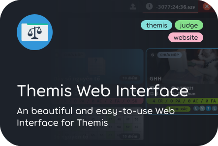
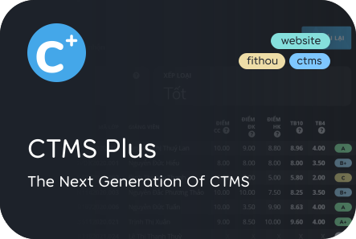

&nbsp;

	
	

&nbsp;

	

	
	
	
	

<h4>🥇 Top Starred Repos:</h4>

|#|Name|Stars|Size|Language|Last Update||
|---|---|---:|---:|:---:|---|--|
|1|**[themis-web-interface](https://github.com/Belikhun/themis-web-interface)**|24 ⭐|26.06 MB|JavaScript|07/10/2021 06:04:17 AM|2 ⚠  \|  12 🥢|
|2|**[StudentsManager](https://github.com/Belikhun/StudentsManager)**|6 ⭐|0.71 MB|Java|03/09/2021 06:07:20 PM|0 ⚠  \|  1 🥢|
|3|**[ctms-plus](https://github.com/Belikhun/ctms-plus)**|4 ⭐|11.25 MB|JavaScript|03/10/2021 05:49:40 AM|4 ⚠  \|  2 🥢|
|4|**[thi-trac-nghiem](https://github.com/Belikhun/thi-trac-nghiem)**|3 ⭐|17.71 MB|JavaScript|24/08/2021 09:29:25 AM|1 ⚠  \|  0 🥢|
|5|**[Belikhun](https://github.com/Belikhun/Belikhun)**|2 ⭐|15.83 MB|Python|07/10/2021 10:32:35 AM|0 ⚠  \|  0 🥢|

	⏰ <b>UPDATED:</b> 07/10/2021 05:43:47 PM (GMT+7)
	&emsp;&emsp;&emsp;&emsp;&emsp;&emsp;&emsp;&emsp;&emsp;&emsp;
	⚗ <b>GENERATED:</b> 0.6669s /w <a href="https://github.com/Belikhun/Belikhun/actions" target="_blank">Github Actions</a>
