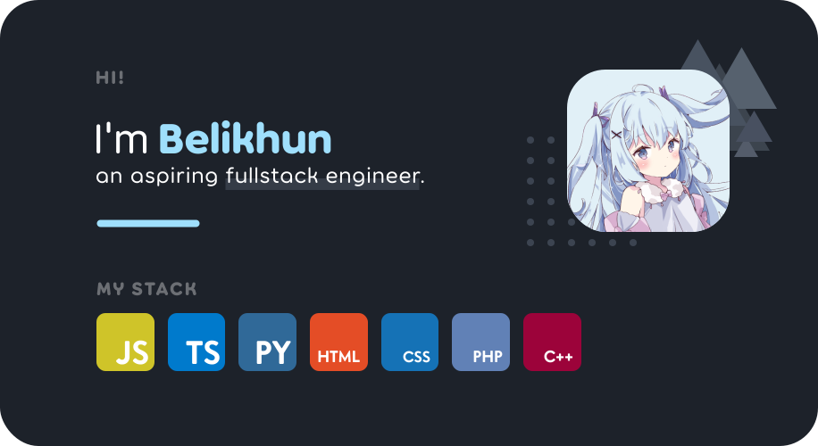

&nbsp;

	
	

&nbsp;

	

	
	
	
	

<h4>🥇 Top Starred Repos:</h4>

|#|Name|Star|Size|Language|Last Update||
|---|---|---:|---:|:---:|---|--|
|1|**[themis-web-interface](https://github.com/belivipro9x99/themis-web-interface)**|23 ⭐|26.0 MB|JavaScript|2021-09-17T07:44:33Z|2 ⚠  \|  12 🍴|
|2|**[StudentsManager](https://github.com/belivipro9x99/StudentsManager)**|6 ⭐|0.71 MB|Java|2021-09-03T18:07:20Z|0 ⚠  \|  1 🍴|
|3|**[ctms-plus](https://github.com/belivipro9x99/ctms-plus)**|4 ⭐|11.07 MB|JavaScript|2021-09-17T06:51:28Z|4 ⚠  \|  2 🍴|

	⏰ <b>UPDATED:</b> 18/09/2021 12:25:49 PM (GMT+7)
	&emsp;&emsp;&emsp;&emsp;&emsp;&emsp;&emsp;&emsp;&emsp;&emsp;
	⚗ <b>GENERATED:</b> 0.2325s /w <a href="https://github.com/belivipro9x99/belivipro9x99/actions" target="_blank">Github Actions</a>
