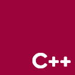

<h2>Hi! 👋</h2>
<h4>My name is Ha, usually known as Belikhun. I'm a Student studying Information Technology. I 💙 OpenSource!

16 🌟  |  7 📂  |  5 👥

<h3>🧬 Language I Can Speak:</h3>

<h3>🥇 Top Starred Repo:</h3>
<table>
<tr>
		<th>#</th>
		<th>Name</th>
		<th>Star</th>
		<th>Size</th>
		<th>Language</th>
		<th>Last Update</th>
		<th></th>
	</tr>
<tr>
			<td style="text-align: right;">1</td>
			<td><a href="https://github.com/belivipro9x99/themis-web-interface" target="_blank">themis-web-interface</a></td>
			<td style="text-align: right;">14 ⭐</td>
			<td style="text-align: right;">24.16 MB</td>
			<td>PHP</td>
			<td style="text-align: right;">2020-10-18T05:55:40Z</td>
			<td style="white-space: pre;">4 ⚠  |  5 🍴</td>
		</tr>
<tr>
			<td style="text-align: right;">2</td>
			<td><a href="https://github.com/belivipro9x99/corona-tracker-extension" target="_blank">corona-tracker-extension</a></td>
			<td style="text-align: right;">2 ⭐</td>
			<td style="text-align: right;">6.68 MB</td>
			<td>CSS</td>
			<td style="text-align: right;">2020-04-30T10:13:58Z</td>
			<td style="white-space: pre;">0 ⚠  |  2 🍴</td>
		</tr>
<tr>
			<td style="text-align: right;">3</td>
			<td><a href="https://github.com/belivipro9x99/belivipro9x99" target="_blank">belivipro9x99</a></td>
			<td style="text-align: right;">0 ⭐</td>
			<td style="text-align: right;">0.12 MB</td>
			<td>Python</td>
			<td style="text-align: right;">2020-11-07T11:16:40Z</td>
			<td style="white-space: pre;">0 ⚠  |  0 🍴</td>
		</tr>
<tr>
			<td style="text-align: right;">4</td>
			<td><a href="https://github.com/belivipro9x99/corona-tracker-backend" target="_blank">corona-tracker-backend</a></td>
			<td style="text-align: right;">0 ⭐</td>
			<td style="text-align: right;">3.55 MB</td>
			<td>PHP</td>
			<td style="text-align: right;">2020-08-21T11:04:17Z</td>
			<td style="white-space: pre;">0 ⚠  |  0 🍴</td>
		</tr>
<tr>
			<td style="text-align: right;">5</td>
			<td><a href="https://github.com/belivipro9x99/dealHunterSuiteArchive" target="_blank">dealHunterSuiteArchive</a></td>
			<td style="text-align: right;">0 ⭐</td>
			<td style="text-align: right;">81.59 MB</td>
			<td>CSS</td>
			<td style="text-align: right;">2020-09-25T16:27:26Z</td>
			<td style="white-space: pre;">0 ⚠  |  1 🍴</td>
		</tr>
</table>

	
⏰ <b>UPDATED:</b> 07/11/2020 11:16:54 AM

	
⚗ <b>GENERATED:</b> 101.667116146s /w Github Actions

