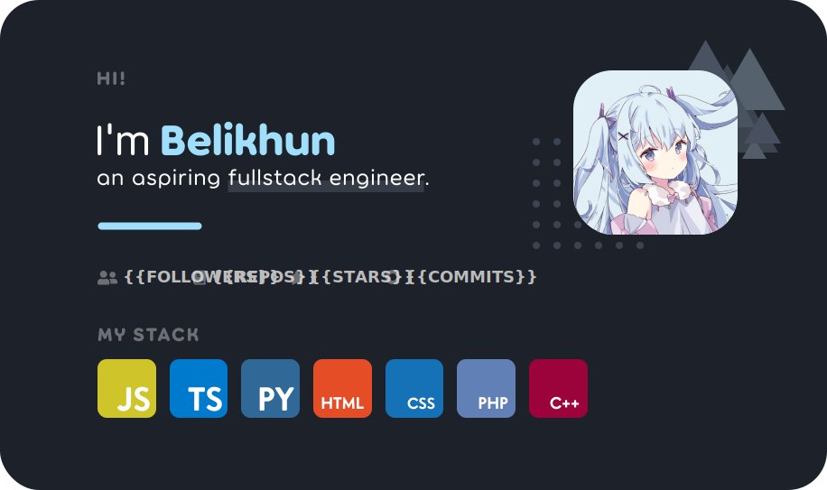

	
	

&nbsp;

	

	
	
	
	

<h4>🥇 Top Starred Repos:</h4>
{{REPOLISTS}}

	⏰ <b>UPDATED:</b> {{TIME}}
	&emsp;&emsp;&emsp;&emsp;&emsp;&emsp;&emsp;&emsp;&emsp;&emsp;
	⚗ <b>GENERATED:</b> {{RUNTIME}}s /w <a href="https://github.com/belivipro9x99/belivipro9x99/actions" target="_blank">Github Actions</a>
